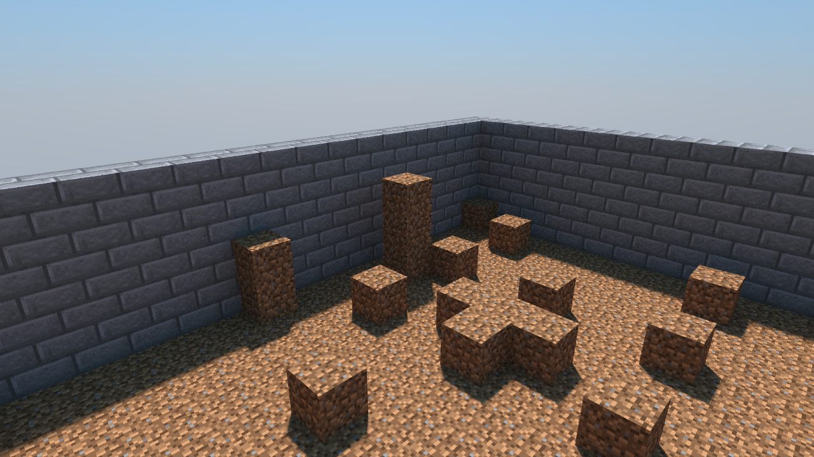
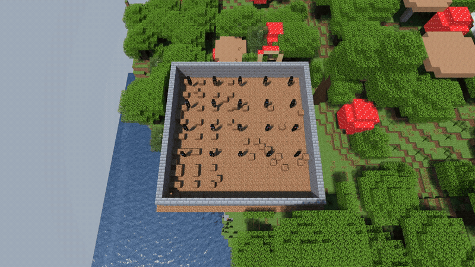
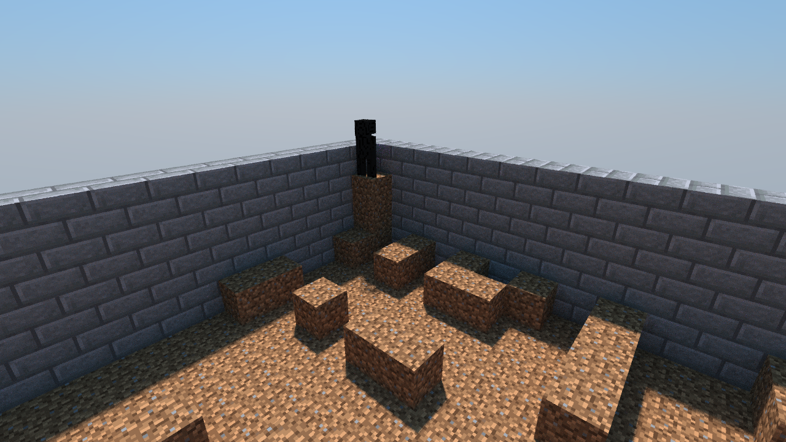

# detmc

A Minecraft Java 26.2 server that plays out the same way every time.

A normal Minecraft server is not reproducible. Mob AI, natural spawning and random ticks
draw from random number generators that vanilla seeds from the system clock. Chunk
generation, lighting and disk reads run on background threads, and their results land in
whatever order the threads finish. detmc is a Fabric mod that pins all of that. Two servers
given the same world seed, the same detmc seed and the same commands produce the same world
tick for tick: same entity positions, same motion, same block changes, same RNG state, same
save files. That is what makes it possible to search many worlds for a rare mob event and
then replay the world that produced it.

Vanilla game logic is untouched. detmc only changes where seeds come from and in what order
the server does its work.

## Features

- Bit-identical replay of the vanilla 26.2 server from one seed. Headless, no player needed.
- Mob AI, natural spawning, random ticks and weather are all covered.
- Runs at full `/tick sprint` speed. Measured cost is 1.13x vanilla ms per tick.
- `/detmc reseed <long>` re-keys the RNG mid-run. One saved world can branch into many timelines.
- The RNG stream position is written into the save, so a resumed run replays the block
  world, the seed stream and mob state.
- Scenario runner: one YAML file per search, a seed prefilter, in-game detectors, snapshots.
- Branching search that keeps the best worlds of each generation and forks children from them.
- Headless renderer (a patched Chunky) that draws blocks and mobs straight from the save files.

## Quick start

Docker is the only requirement. There is no host JDK and no host Gradle.

```bash
./fetch-deps.sh                   # pulls the 26.2 server jar from Mojang for the classpath
./docker-gradle.sh :fabric:build  # -> fabric/build/libs/detmc-0.1.0.jar
```

Put the jar in `mods/` of a Fabric 26.2 server. Start the server with:

```
-Ddetmc.seed=<long> -Ddetmc.freezeOnStart=true -Dmax.bg.threads=1
```

`freezeOnStart` holds the world before tick 1, so every setup command lands before anything
ticks. Send your commands over rcon, then run `/tick unfreeze` or `/tick sprint <n>`.

- `/detmc rng` prints the RNG state. `/detmc reseed <long>` re-keys it.
- The inputs are the world seed, `-Ddetmc.seed` and the command script. Change one and you
  get a different world.
- `-Dmax.bg.threads=1` shrinks the thread pools detmc has not captured.

More on the mixins, the flags and the harness: `docs/INTERNALS.md`. Every measurement and
every open question: `docs/STATUS.md`.

## Results

Each row names the jar it was measured on, by the first 4 bytes of its sha256. Building this
tree with the commands above produced `a20b86a0...` byte for byte, so rows one and three are
a jar you can rebuild here. Row two ran on an earlier jar. Every number below is recorded in
`docs/STATUS.md` and `test/cross-machine/RESULT.md` with the run artifacts it came from.

| What was compared | Jar | Result |
|---|---|---|
| two servers, same host, 24,000 ticks, natural spawning on | `a20b86a0` | no divergence, 0 of 24,001 gametimes |
| two servers on two VMs on one host, 24,000 ticks | `b2205b1b` | no divergence, 0 of 24,001 gametimes |
| `tick sprint 20000` against the same image with `mods/` emptied | `a20b86a0` | 1.13x ms per tick, 4.70 against 4.18 |

"No divergence" is four checks, not one:

- A per-tick digest over every entity's UUID, position and motion, plus the level RNG's
  draw count and state. Equal at every gametime.
- `Pos`, `Motion`, `carriedBlockState` and `UUID` of every entity at the final tick. Equal.
- The entity save files, byte for byte. 330,476 bytes on both sides.
- Region files, compared after blanking the per-chunk save timestamps. 12 of 12 equal across
  the two VMs, 11 of 12 on the same host. The 12th held 21 extra part-generated chunks
  outside the loaded area, and the 366 chunks both sides had were identical.

The throughput row is the median of three interleaved sprints per variant, each from a fresh
world, one container at a time.

What this does not show:

- Verified on two VMs on one host, not on two physical machines.
- The two VMs did see different CPU models and different instruction-set flags, so the two
  JVMs compiled different machine code and still agreed tick for tick. Their startup wall
  time differed by 100 frozen ticks.
- A run resumed from a save does not rejoin the timeline of a run that was never
  interrupted. Vanilla stores no draw position for a live `RandomSource`, so those objects
  restart from a fresh seed.
- Two runs resumed from the same save used to disagree on mob state on a village world:
  villager, sheep and iron golem `Pos`, `Motion` and `Rotation`, up to 1.3 blocks apart,
  3 of 62 entity chunks after 6,000 ticks. The cause was `AcquirePoi` seeding its per-POI
  retry timers by walking a `HashSet` whose key has no `hashCode`, so the level
  `RandomSource` ended up one draw apart between the two runs. Fixed 2026-09-13
  (`AcquirePoiMixin`): the same pair now reads **0 of 62** entity chunks differing in
  canonical NBT, with the per-tick digest and the level draw count identical at all 6,001
  gametimes. Details in `docs/STATUS.md`, "that divergence is `AcquirePoi`".
- The one residual after that fix, two zombies in a single entity chunk that still ended
  up in different places in one of two 6,000-tick pairs, was the checkpoint copy and not
  the game: a plain `save-all` returns while the entity region writes are still queued on
  the IO worker, and the copy caught one chunk at the previous save, one gametime older.
  The mod now waits for those writes before it writes the sidecar the harness copies on
  (`detmc.saveBarrier`, default on). Three more 6,000-tick pairs read 0 of 62 entity
  chunks differing, with every entity chunk stamped by the final save in both runs.
  Details in `docs/STATUS.md`, "the residual was the checkpoint copy".
- `Brain.memories` serialises in an unstable key order, because `MemoryModuleType`
  declares no `hashCode`. It is serialisation order only: the two entity chunks that still
  differ byte-for-byte in the pair above hold identical values. `branch.py verify` reports
  those separately from a real difference.

### Endermen build a 3-block pillar



Twenty endermen in a walled pen with loose dirt at foot level. The search ran 8 worlds per
generation, kept the best 4 and forked 2 children from each. At in-game tick 799,960, which
is day 33, one enderman stacked a third block on a 2-stack at (89, 136..138, -21). The
pillar was still standing at tick 912,001, when the render above was taken.

The same lineage hit again at gametime 2,350,060 in node `g48n5`. Overhead time-lapse of the
whole pen, 47 frames at 8 fps:



Low-angle still of that tick, an enderman standing on the finished pillar:



Video versions of both angles are in `docs/media/`.

### Replaying the find

| | |
|---|---|
| world seed | `12345` |
| scenario | `runner/scenarios/enderman_hunt.yaml` |
| base RNG seed | `-Ddetmc.seed=8` |
| lineage | `runner/examples/hunt-br-wave1-lineage.jsonl`, node `g18n0` |
| reseed points | 18, one per 48,000-tick segment |
| jar it ran on | `fec838e1` |

```bash
cd runner
python3 -m venv .venv && .venv/bin/pip install pyyaml
.venv/bin/python branch.py replay examples/hunt-br-wave1-lineage.jsonl g18n0 \
    --run-id g18n0-replay --jar <the jar the search ran on>
```

The lineage file holds the reseed schedule of every node, which is what a replay needs.
Replays are only bit-identical on the jar the search used, so `--jar` takes a path.

Measured on that jar: all 19 legs of the lineage matched the search on score metrics, chunk
contents, RNG state and the pillar column. Three more replays of the final leg alone matched
as well. A sibling node, same parent and a different reseed, differs at exactly the block
that makes `g18n0` a 3-stack.

`branch.py verify` compares two checkpoint directories and needs no server. The search's own
checkpoints are not in this repo, so compare two replays of your own.

## Layout

| Directory | What is in it |
|---|---|
| `common/` | the mod: `DetRng`, the bootstrap and every mixin |
| `fabric/` | Fabric entry point and `fabric.mod.json` |
| `neoforge/` | stub, not built |
| `runner/` | scenario runner, seed prefilter and the branching search |
| `camera/` | headless renderer, the Chunky patch and the camera scripts |
| `montecarlo/` | rate estimates for how often the searched events should happen |
| `test/` | the determinism cases and the runner that drives them |
| `docs/` | `REFERENCE.md` (every flag and command in one place), `INTERNALS.md`, `STATUS.md` and the media above |

## License

Our code is MIT, in `LICENSE`.

`camera/chunky-mobs.patch` is not. It is a patch against
[Chunky](https://github.com/chunky-dev/chunky), which is GPLv3, so the patch and anything
built from it are GPLv3 too. See `camera/LICENSE-chunky-patch.md` for the upstream commit it
applies to.

No Minecraft code is in this repository. `fetch-deps.sh` downloads the server jar from
Mojang at build time and `camera/fetch-textures.sh` downloads the client jar for textures.
Both stay out of git.
